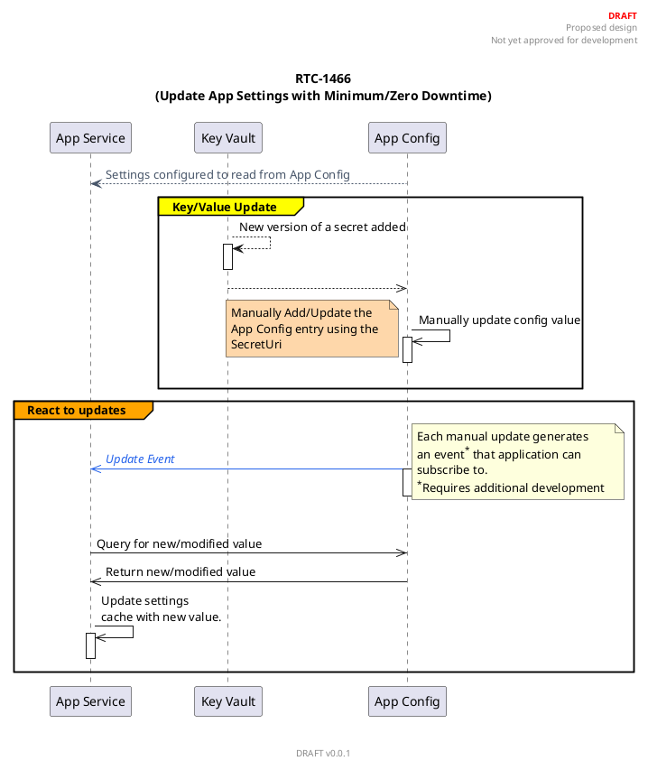

---
tags:
  - RTC20
  - APPCFG
  - RTC-1466
---

Proposed solution/approach

```plantuml 
@startuml  
  
skinparam ParticipantPadding 30  
  
title RTC-1466\n(Update App Settings with Minimum/Zero Downtime)  
  
  
participant "App Service" as AS  
participant "Key Vault" as KV  
'skinparam ParticipantBackgroundColor #60A5FA  
participant "App Config" as AC  
<style>  
root {  
  Padding 0  
  Margin 5  
}  
  
title {  
    Padding 0  
    Margin 20  
}  
</style>  
AS <-[#475569]- AC:<font color="#475569">Settings configured to read from App Config</font>  
group#yellow Key/Value Update  
KV --> KV ++--:New version of a secret added  
KV -->> AC  
AC ->>AC ++--: Manually update config value  
note left #FED7AA  
Manually Add/Update the  
App Config entry using the  
SecretUri  
end note  
end  
group#orange React to updates  
AS <<[#2563EB]- AC:<font color="#2563EB"><i>Update Event</i></font>  
activate AC  
deactivate AC  
note right  
Each manual update generates  
an event<sup>*</sup> that application can  
subscribe to.  
<sup>*</sup>Requires additional development  
end note  
  
AS ->> AC: Query for new/modified value  
AC ->> AS: Return new/modified value  
AS ->> AS:Update settings\ncache with new value.  
activate AS  
deactivate AS  
end  
  
header  
<font color=red><b>DRAFT</b></font>  
Proposed design  
Not yet approved for development  
endheader  
  
center footer  
  
  
DRAFT v0.0.1  
end footer  
  
  
@enduml
```
